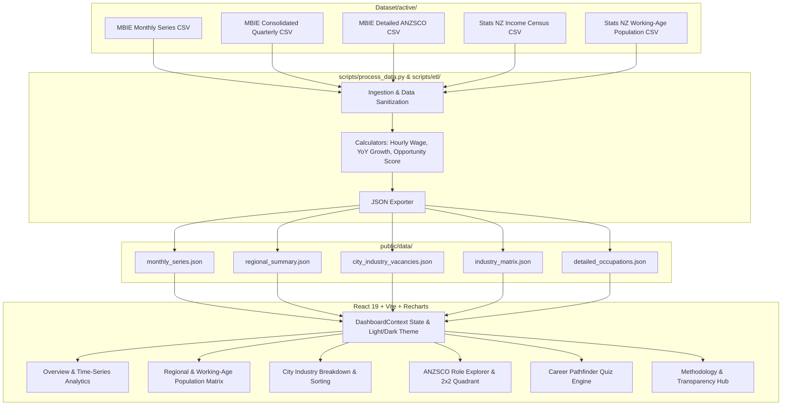

# New Zealand Labour Market & Income Intelligence Dashboard

> **End-to-End Full-Stack Data Engineering, Analytics Platform & Career Decision System**  
> An interactive labor market analytics platform connecting **MBIE Jobs Online vacancy indices (2007–2026)** with **Stats NZ Census income benchmarks** and **Stats NZ Working-Age Population Census data**. Built to empower job seekers, HR leaders, and policymakers with data-driven salary, vacancy density, and regional career decision intelligence.

---

## 🌟 Key Features & Capabilities

* 📊 **Nationwide Vacancy Trajectory (2007 – 2026)**: Time-series analysis of NZ online job vacancy volume filtered by region, industry, ANZSCO occupation categories, and skill levels.
* 📍 **10 NZ Labour Market Regions & City Breakdown**: Comprehensive coverage of all 10 MBIE regions (Auckland, Wellington, Canterbury, Waikato, Bay of Plenty, Otago/Southland, etc.) and major cities (Hamilton, Tauranga, Christchurch, Dunedin, Palmerston North, Whangarei).
* 👥 **Working-Age Population Filtering (Ages 15–64)**: Calculates per-capita job vacancy density per 100,000 active working-age residents, excluding children under 15/18 and retirees over 65 for maximum labor supply accuracy.
* 🏭 **City Industry Vacancy Matrix (100 Cells)**: Deep breakdown of exact MBIE vacancy indices, YoY growth rates, and hourly rates for **every industry in every New Zealand city**.
* 💵 **Hourly Wage Benchmarking**: Calculates hourly salary rates across all cards and tables using a standard $40\text{ hr/wk}$ baseline ($ \text{Hourly Wage} = \text{Median Weekly Income} / 40.0 $).
* 🔀 **Interactive Column Header Sorting**: Click any table header across all regional and industry tables to toggle ascending (**▲**) or descending (**▼**) sort order.
* 🌓 **Light & Dark Mode**: Default set to modern Light Mode with a high-contrast Sun/Moon toggle.
* 🎯 **Industry Opportunity 2x2 Quadrant**: Categorizes NZ sectors into *Star (High Growth & High Salary)*, *High Demand*, *High Salary Niche*, and *Stable* tiers.
* 🧭 **NZ Career Pathfinder Guide**: Interactive 3-step decision guide generating custom **Career Strategy Briefs** with regional recommendations and salary benchmarks.
* 🛡️ **Zero Artificial Data Standard**: Enforces strict data hygiene — missing source data renders explicit *"No data available"* notices without fabricating dummy numbers.

---

## 🏗️ System Architecture



---

## 📁 Repository Directory Structure

```
NZ Labour Market Intelligence Dashboard/
├── Dataset/
│   ├── active/                   # Cleaned active CSV datasets used by ETL pipeline
│   │   ├── Census_Population_by_age_by_Regional_Council_2001_2006_2013.csv
│   │   ├── Income by sex, region, ethnic groups and income source.csv
│   │   ├── jobs-online-all-unadjusted-quarterly-data-consolidated-march-2026.csv
│   │   ├── jobs-online-detailed-occupational-data-march-2026-quarter.csv
│   │   └── jol-monthly-unadjusted-series-from-may-2007-june-2026.csv
│   └── archive_other/            # Raw un-used datasets, Excel files, and historical archives
├── public/
│   └── data/                     # Compiled JSON datasets for fast web fetching
│       ├── career_pathfinder_rules.json
│       ├── city_industry_vacancies.json
│       ├── detailed_occupations.json
│       ├── industry_matrix.json
│       ├── monthly_series.json
│       └── regional_summary.json
├── scripts/
│   ├── config/
│   │   └── benchmarks.json       # Industry salary benchmarks & city mappings
│   ├── etl/                      # ETL core modules
│   │   ├── __init__.py
│   │   ├── calculators.py        # Mathematical domain formulas & metric calculators
│   │   └── ingestion.py          # Data cleaning & Pandas ingestion helpers
│   ├── tests/
│   │   ├── __init__.py
│   │   └── test_calculators.py   # Automated Python unit test suite
│   └── process_data.py           # Main Python ETL data pipeline entry point
├── src/
│   ├── components/               # Modular React UI Components
│   │   ├── CareerPathfinder.jsx  # Interactive job seeker decision guide
│   │   ├── Header.jsx            # Navigation, tab management & theme toggle
│   │   ├── IndustryQuadrant.jsx  # 2x2 Opportunity matrix & ANZSCO role explorer
│   │   ├── KPICards.jsx          # Executive KPI summary cards
│   │   ├── Methodology.jsx       # Data provenance & methodology transparency hub
│   │   ├── Overview.jsx          # Time-series charts & market overview
      │   └── RegionalMatrix.jsx    # Regional matrix & city industry vacancy table
│   ├── context/
│   │   └── DashboardContext.jsx  # Global React Context & theme state provider
│   ├── utils/
│   │   └── selectors.js          # Pure data selectors, filtering & sorting logic
│   ├── App.jsx                   # Main React root layout
│   ├── index.css                 # Custom CSS Design System (Light/Dark themes)
│   └── main.jsx                  # React DOM entry point
├── index.html                    # HTML entry point with Google Fonts & Meta SEO
├── package.json                  # Node dependencies & npm scripts
├── vite.config.js                # Vite bundler configuration
└── README.md                     # Project documentation
```

---

## ⚡ Quick Start & Setup Guide

### Prerequisites
* **Node.js**: v18.0 or higher
* **Python**: v3.9 or higher (with `pandas`)

### 1. Clone the Repository & Install Dependencies
```bash
git clone https://github.com/BinkeXu/New-Zealand-Labour-Market-Income-Intelligence-Dashboard.git
cd "New-Zealand-Labour-Market-Income-Intelligence-Dashboard"

# Install frontend dependencies
npm install
```

### 2. Run Python Unit Tests
Verify that all mathematical calculators and formulas pass unit tests:
```bash
python -m unittest scripts/tests/test_calculators.py
```

### 3. Execute the Python ETL Data Pipeline
Process active source CSVs from `Dataset/active/` and build compiled JSON datasets in `public/data/`:
```bash
python scripts/process_data.py
```
*Or run via npm:*
```bash
npm run etl
```

### 4. Launch Local Development Server
```bash
npm run dev
```
Open your browser at **`http://localhost:3000`** to interact with the live dashboard!

### 5. Build for Production
```bash
npm run build
```

---

## 🧮 Mathematical Formulas & Data Dictionary

### 1. Working-Age Population-Adjusted Regional Opportunity Score
$$\text{Opportunity Score} = \left( \frac{\text{Vacancies Per 100k Working-Age}}{50.0} \right) \times \left( \frac{\text{Median Weekly Income}}{\$1,200.00} \right) \times 100$$
$$\text{Where: } \text{Vacancies Per 100k Working-Age} = \left( \frac{\text{MBIE Regional Vacancy Index}}{\text{Working-Age Population (Ages 15–64)}} \right) \times 100,000$$

### 2. Hourly Wage Conversion
$$\text{Hourly Wage (\$ / hr)} = \frac{\text{Stats NZ Median Weekly Income}}{40.0\text{ hours/week}}$$

### 3. Annualized Salary Benchmark
$$\text{Annualized Salary (\$ / yr)} = \text{Stats NZ Median Weekly Income} \times 52.0\text{ weeks/year}$$

### 4. Year-over-Year (YoY) Growth Percentage
$$\text{YoY Growth \%} = \left( \frac{\text{Index}_{\text{Current Quarter}} - \text{Index}_{\text{Same Quarter Last Year}}}{\text{Index}_{\text{Same Quarter Last Year}}} \right) \times 100$$

---

## 🌐 Data Provenance & Official Sources

| Dataset Name | Publishing Agency | Project File Location | Time Horizon & Frequency | Extracted Variables |
| :--- | :--- | :--- | :--- | :--- |
| **Jobs Online Monthly Series** | MBIE | `Dataset/active/jol-monthly-unadjusted-series...csv` | May 2007 – June 2026 (Monthly) | National Totals, 5 Main Regions, 10 ANZSIC Sectors, 5 Skill Levels |
| **Jobs Online Quarterly Series** | MBIE | `Dataset/active/jobs-online-all-unadjusted...csv` | Dec 2010 – March 2026 (Quarterly) | Overall Vacancies per Region, Industry Vacancies per City (100 cells) |
| **Detailed ANZSCO Release** | MBIE | `Dataset/active/jobs-online-detailed-occupational...csv` | March 2026 Quarter | 100+ 4-digit ANZSCO Role Titles, ANZSCO Codes, Annual % Changes |
| **Regional Income Census** | Stats NZ | `Dataset/active/Income by sex, region, ethnic...csv` | 1998 – 2025 Annual Census | Median & Average Weekly Wage across 12 Regional Councils |
| **Regional Population Census** | Stats NZ | `Dataset/active/Census_Population_by_age...csv` | 2001, 2006, 2013 Census Release | Working-Age Population Counts per Regional Council (excluding <15 & 65+) |

---

## 👤 Author & Job Seeker Portfolio

* **Developer**: Junior IT / Data Engineer / Full-Stack Developer candidate in New Zealand
* **Goal**: Showcase end-to-end software engineering capability — from python data pipeline architecture and unit testing to clean React UI/UX design, interactive tabular sorting, and cloud deployment readiness.
* **Tech Stack**: React 18, Vite, Python 3, Pandas, Recharts, Lucide Icons, Custom CSS Design System, Node.js.

---

*Licensed under the MIT License.*
